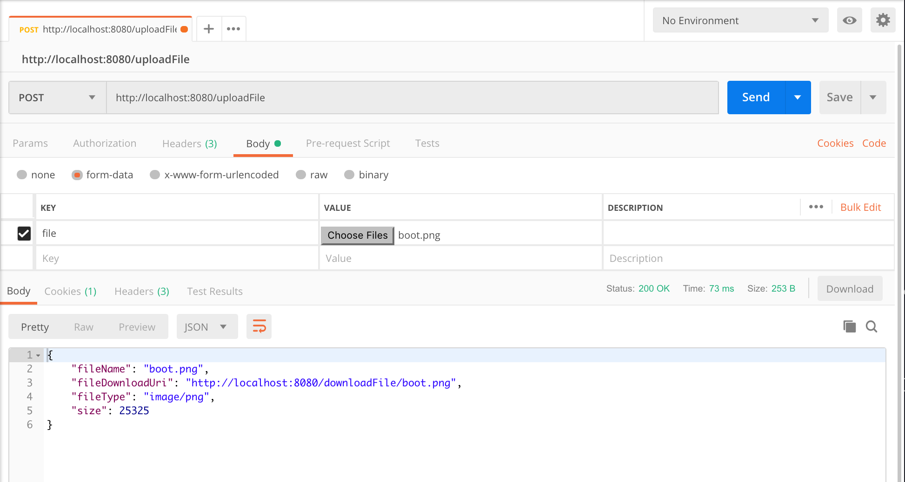
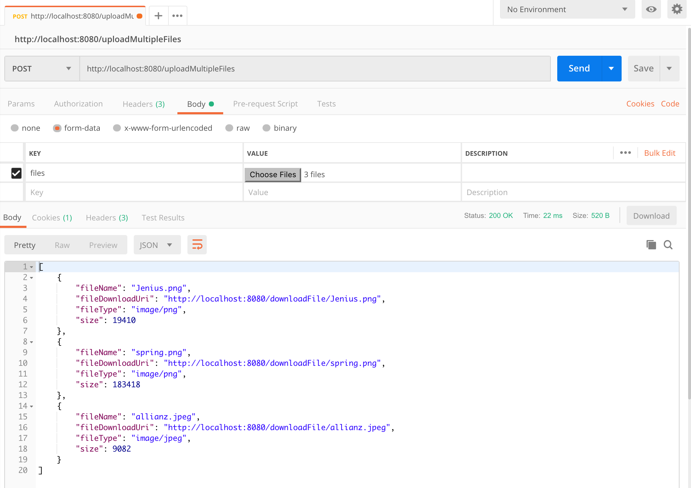
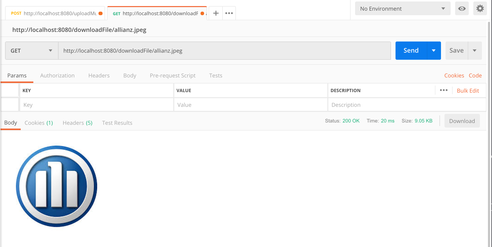
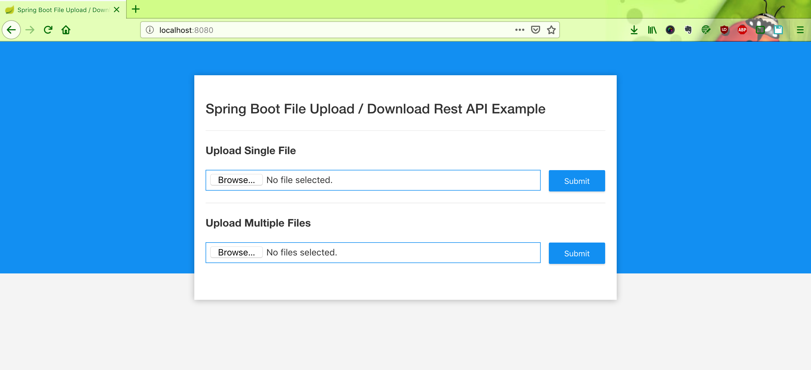
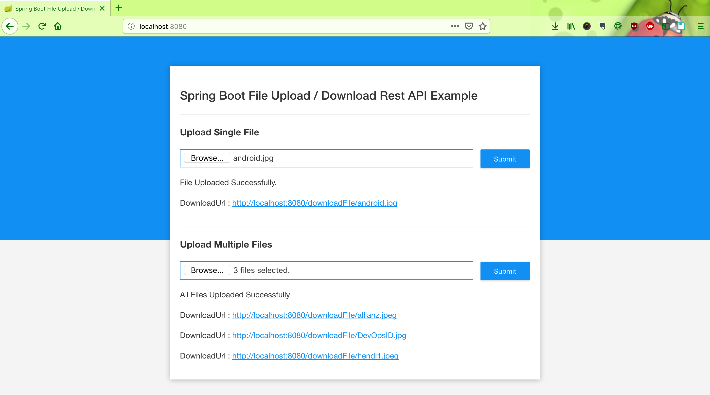

# spring-boot-upload-download-file-rest-api-example

Run this project by this command : `mvn clean spring-boot:run`

### Screenshot

Upload Single File

Upload Multiple Files

Download File

Upload Home Page

Upload File Page

